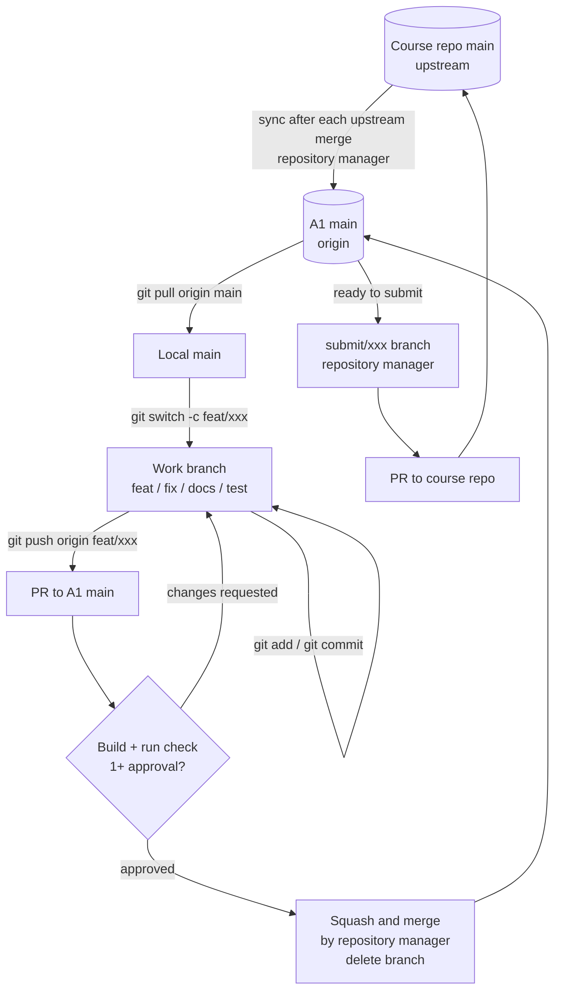

# A1 Git Workflow

> Team **A1** · CSE2024 Software Development Practices (Section 23621) · Requirement: *Player & Enemy Ship Variety*
> Team repository (fork): https://github.com/calzsvg/A1-SDP
> Course repository (upstream): https://github.com/oh-gnues/Invaders-SDP-23621

---

## 1. Workflow and Rationale

**Chosen workflow: Feature Branch Workflow (inside the team repository) + Forking Workflow (toward the course repository), with team-defined PR review rules**

- **Inside the team repository:** All members share one repository (a centralized team repository) and follow the Feature Branch Workflow: each feature or fix gets its own short-lived branch from `main`, which is merged back into `main` and then deleted.
- **Team-defined rules:** The Feature Branch Workflow leaves PR rules, merge methods and release timing to the team. A1 defines them in Section 4 (Pull Requests and Review) and Section 5 (Merge Strategy).
- **Toward the course repository:** We have no write access, so all contributions go through pull requests from our fork. The repository manager acts as the *integration manager*.

### Decisions (based on the five workflow questions)

| Question | A1 decision |
|---|---|
| **Who can write to the project?** | Members push work branches to the team repository. Only the repository manager (Hoyoung Yoon, @calzsvg) merges into `main` and opens PRs to the course repository. No one pushes directly to `main` in either repository. |
| **How quickly can changes integrate?** | Short-lived branches and PRs. After at least one approval and a passing check, changes are merged as soon as possible. Large features are split into smaller PRs. |
| **How does the project release?** | No `develop` or `release` branches. The reviewed and tested `main` is always the current integrated version. When changes are ready, a submission branch is created from `main` for a PR to the course repository. |
| **Which versions need maintenance?** | Only the latest `main`. Bugs are fixed on `fix/...` branches and merged into `main`; if the bug is already in the course repository, the fix is also submitted there. |
| **Who owns integration?** | Feature authors own their code, tests and ordinary conflicts. The repository manager owns final merges into `main`, syncing with the course repository, and all upstream PRs. |

### Why this fits our current project

- **Every member is new to Git.** Members only learn one flow: *branch → PR to team `main`*. They never interact with the course repository, which removes the most common beginner mistake (opening a PR against the wrong repository).
- **Integration is concentrated in one role.** Syncing, submitting and resolving cross-team issues are handled by the integration manager, matching the Forking Workflow model.
- **Ten teams share one codebase.** Our ship variety feature touches code other teams also depend on. Integrating small changes often keeps conflicts small.
- **No versioned releases.** This is a 12-week project with one evolving result. Gitflow's `develop`, `release` and `hotfix` branches would add work without benefit; our `main` already serves as the integration branch.
- **Why Feature Branch rather than GitHub Flow.** GitHub Flow assumes that merging into `main` is followed by deployment. A1 has no deployment environment; our result is submitted to the course repository by pull request. We therefore start from the Feature Branch Workflow and add only the review rules our team needs, choosing the simplest combination that meets our needs.

---

## 2. Branch Strategy

| Branch | Lifetime | Role | Who pushes |
|---|---|---|---|
| `main` | Permanent | Team integration branch. Must always build and run. Protected. | No direct push (merged by PR only) |
| `feat/<short-name>` | Short | New feature or part of one. e.g. `feat/enemy-ship-types` | Author |
| `fix/<short-name>` | Short | Bug fix. e.g. `fix/player-hitbox` | Author |
| `docs/<short-name>` | Short | Documentation only. e.g. `docs/git-workflow` | Author |
| `test/<short-name>` | Short | Tests only. | Author |
| `submit/<short-name>` | Until upstream PR closes | Snapshot of `main` used for a PR to the course repository. | Repository manager |

Names use lowercase English and hyphens. An issue number may be added: `feat/12-enemy-ship-types`.

### Creating
- Create work branches from the **latest** `main` only. One branch = one feature or one related change.

```bash
git switch main
git pull origin main
git switch -c feat/enemy-ship-types
```

### Merging
- Only through a PR into `main` that meets Section 4. Merged by the repository manager.

### Deleting
- Work branches are deleted right after merging.
- `submit/...` branches are deleted after the upstream PR is merged or closed.

```bash
git switch main
git pull origin main
git branch -d feat/enemy-ship-types
```

### Syncing with the course repository (repository manager)
- Sync whenever a PR is merged into the course repository, and always before creating a `submit/...` branch.

```bash
git fetch upstream
git switch main
git merge upstream/main
git push origin main
```

- Every member sets `upstream` as fetch-only: `git remote set-url --push upstream no_push`
- After a sync, members with open branches bring the new `main` into their branch (see Section 5).

### Submitting to the course repository (repository manager)
A PR follows its branch, so a PR opened directly from `main` would absorb every later merge. A snapshot branch keeps the upstream PR fixed.

```bash
git switch main
git pull origin main
git switch -c submit/enemy-ship-types
git push origin submit/enemy-ship-types
# Open a PR: calzsvg/A1-SDP submit/enemy-ship-types → oh-gnues/Invaders-SDP-23621 main
```

---

## 3. Commit Rules

### What belongs in one commit
- **One logical change** describable in one sentence.
- The project still builds after the commit.
- Formatting-only changes are not mixed with logic changes.
- No build outputs, IDE settings (`.idea/`, `out/`) or personal files. Check `git status` before every commit.

### Message format
Follow `.gitmessage.txt`. Summary line: `<type>: <summary>`

| Type | Use for |
|---|---|
| `feat` | New feature |
| `fix` | Bug fix |
| `docs` | Documentation |
| `test` | Adding or updating tests |
| `refactor` | Code change with no behavior change |
| `style` | Formatting only |
| `chore` | Build settings, config, maintenance |

- Summary: English, imperative mood, ≤ 50 characters, no period.
- Body (optional): explain **why**, wrapped at 72 characters.
- Footer (optional): `Closes #12`

```
feat: Add fast enemy ship type

Fast ships move twice as quickly but have lower HP,
adding variety to the enemy formation.

Closes #12
```

---

## 4. Pull Requests and Review

The Feature Branch Workflow leaves review rules to the team. A1 adds the following rules.

### Direct pushes to `main`
- **Not allowed**, in the team repository or the course repository. `main` is protected by a branch protection rule (PR required, 1 approval required).
- The only exception is the repository manager's upstream sync (Section 2).

### When to open a PR
- When the change is ready for review: it builds and has been checked locally.
- A **Draft PR** may be opened early to share progress or ask for help.
- Work that would take more than about a week is split into smaller PRs.

### PR contents
- **Title:** same format as commit messages.
- **Description:** what changed, why, how it was checked, related issue, screenshots/GIFs for visible changes.

### Check before merging
- Required: the project builds, and the changed feature was run and verified in the game.
- If automated checks (GitHub Actions) are configured, they must pass.

### Approval conditions
- At least **1 approval** from a member who is not the author.
- At least **2 approvals** for changes to code covered by dependency agreements with other teams.
- PRs by the repository manager also need 1 approval from another member before merging.
- No merge while checks fail or review comments are unresolved.
- Reviewers respond within **48 hours**; otherwise the author mentions them in the team chat.

### Merging and upstream PRs
- The repository manager merges approved PRs into `main` and deletes the branch.
- Only the repository manager opens and manages PRs to the course repository, using `submit/...` branches.
- Corrections requested by the course are also submitted by PR ("All corrections require a PR and a merge into main").
- **Backup:** the team leader (Shin Hui Lee, @illtr) takes over merging and upstream PRs when the repository manager is unavailable.

---

## 5. Merge Strategy

The Feature Branch Workflow also leaves the merge method to the team. A1 uses the following methods.

| Situation | Method | Reason |
|---|---|---|
| Work branch → A1 `main` | **Squash and merge** | One PR becomes one clean commit. Since upstream PRs are made from `main`, squashing does not break history with the course repository. |
| `upstream/main` → A1 `main` | **Merge commit** | Keeps the course repository's history intact so later syncs stay simple. |
| Rebase | **Not used on shared branches** | Rewriting shared history is risky for Git beginners. Allowed only on your own branch before anyone else uses it. |

### Resolving conflicts
1. **Feature authors** resolve ordinary conflicts on their own branch by bringing in the latest `main`:

```bash
git switch main
git pull origin main
git switch feat/enemy-ship-types
git merge main
# fix files, remove <<<<<<< ======= >>>>>>> markers
git add <resolved files>
git commit
git push origin feat/enemy-ship-types
```

2. **Complex conflicts** (another member's code, other teams' code, or changes from an upstream sync) are resolved by the author together with the repository manager.
3. After resolving, build and run the game again; request re-review if the logic changed.
4. Prevention: keep branches short, pull `main` often, announce in the team chat before editing shared files.

---

## 6. Overall Workflow

Feature Branch Workflow inside A1 (with team review rules) + Forking Workflow toward the course repository.



---

## 7. Roles and Additional Rules

| Role | Responsibility |
|---|---|
| Feature author | Implementation, local check, ordinary conflicts on own branch |
| Reviewer | Code review and approval |
| Repository manager (Hoyoung Yoon) | Merges into A1 `main`, branch/PR management, upstream sync, upstream PRs |
| Team leader / backup manager (Shin Hui Lee) | Requirements, schedule, LMS submission; takes over the repository manager's duties when unavailable |

- **Issues:** Every task is recorded as a GitHub Issue with an assignee before work starts.
- **Dependencies:** Agreements with other teams are recorded in `teams/A1.md` and announced to the affected team before related changes are merged.
- **Ask first:** If a Git command fails or you are unsure, ask in the team chat instead of forcing it. Never use `git push --force` on `main`.

*This document is reviewed when team structure, deadlines or integration delays change.*
